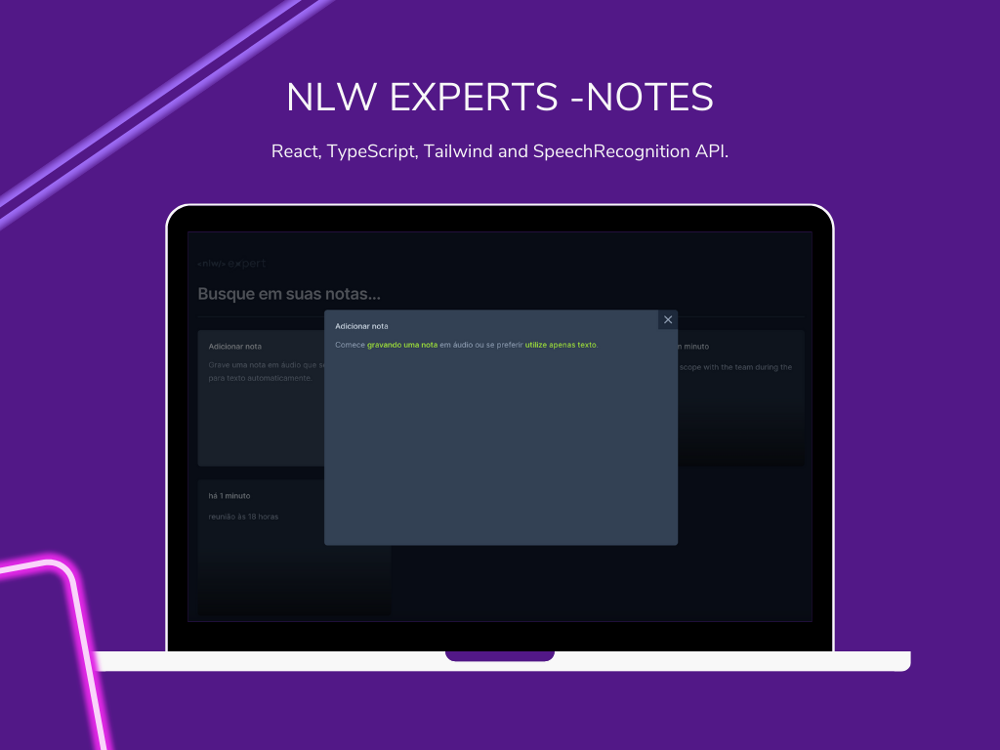

# NLW Expert Notes - ReactJS

NLW Expert Notes is a note-taking application built with React, TypeScript, and Tailwind CSS. It leverages the SpeechRecognition API to allow users to record notes using their voice.



## Built With

This project was bootstrapped with [Vite](https://vitejs.dev/). Vite provides a faster and leaner development experience for modern web projects.

## Features

- Create new notes using text input or voice recording
- View existing notes in a clean, organized layout
- Delete notes as needed

## Technologies Used

- [React](https://reactjs.org/)
- [TypeScript](https://www.typescriptlang.org/)
- [Tailwind CSS](https://tailwindcss.com/)
- [SpeechRecognition API](https://developer.mozilla.org/en-US/docs/Web/API/SpeechRecognition)

## Installation

First, clone the repository to your local machine:

```sh
git clone <repository-url>
```

Then, navigate to the project directory and install the dependencies:

```sh
cd nlw-expert-notes
npm install
```

## Usage

To start the development server, run:

```sh
npm run dev
```

The application will be available at `http://localhost:5173/`.

## Contributing

Pull requests are welcome. For major changes, please open an issue first to discuss what you would like to change.

## License

[MIT](https://choosealicense.com/licenses/mit/)
